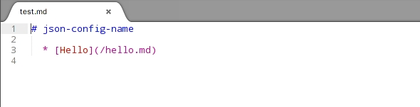

# Gitbook Summary

[](https://badge.fury.io/js/gitbook-summary)
[](https://travis-ci.org/imfly/gitbook-summary)
[](https://david-dm.org/imfly/gitbook-summary)
[](https://coveralls.io/r/imfly/gitbook-summary)


A command line tool to generate a `SUMMARY.MD` from a folder。[Demo](http://imfly.github.io/how-to-create-self-publishing-platform) [中文文档](http://imfly.github.io/how-to-create-self-publishing-platform/3-%E5%A6%82%E4%BD%95%E6%89%93%E9%80%A0%E8%87%AA%E5%B7%B1%E7%9A%84%E5%B9%B3%E5%8F%B0%EF%BC%9F/2-Summary%E7%9A%84%E4%BD%BF%E7%94%A8.html)

## Features

- Generate `SUMMARY.md` by using a CLI with some options
- Setting with `book.json`
- Link `README.md` to the parent directory
- Only get '.md' files
- Order by alphabet or numbers
- ...

## CoC (Convention over Configuration)

Source directory:

```
sources
├── 1-FirstChapter   // The first chapter，format: {orderNumber or alphabet}-{chapterName}.md
├────── 1-FirstDocument.md
├────── 5-SecondDocument.md  // concentrating solely on the order, not the numbers.
├── 3-SecondChapter                     // Focus only on the order, not the numbers.
├────── 1-FirstDocumentOfSecondChapter.md
├────── 2-SecondDocumentOfSecondChapter.md  
├── 7-ThirdChapter
├── FourthChapter  // May have no order
├── README.md // In addition to readme.md, not to put other markdown documents
└── book.json     // Set up the book
```

## Install

```
npm install -g gitbook-summary
```

## Using

1> Generate a `SUMMARY.md` Simply

```
$ cd /path/to/your/book/
$ book sm
```

or, For example:

```
$ book sm -r ../sailsjs-docs-gitbook/en -i 0home -u 'myApp' -c 'concepts, reference, userguides' -n "Sails.js 官方文档(中英合辑）"
```

**Note**： `-s` or `--sortedBy` can not be given `-`, commander.js will parse it an option. But you can set it in `book.json` as follow.

2> Create a `book.json` in the book`s root folder

for example:

```
// test/books/config-json/book.json
{
    "bookname": "json-config-name",
    "outputfile": "test.md",
    "catalog": "all",  // or [chapter1，chapter2, ...]
    "ignores": [],  //Default: '.*', '_book'...
    "unchanged": [], // for example: ['myApp'] -> `myApp` not `My App`
    "sortedBy": "-"
}
```

then, you can do:

```
$ book sm
```

You will get a `test.md` file:



3> Get a markdown artical from a html file or a remote url

```
$ book md -l "http://book.btcnodejs.com/index.html" -s "div.className"
```

You will get the 'index.html' and 'index.md'.

4> Get convert between zh and zh-tw, zh-hk, or zh-sg

```
$ book cv -f ./test/language/test.md -l zh-tw -t "./test/language/test2.md"
```

## eBooks

* 《Nodejs开发加密货币》： https://github.com/imfly/bitcoin-on-nodejs
* 《用Gitbook和Github轻松搭建自出版平台》： https://github.com/imfly/how-to-create-self-publishing-platform
* 《sails.js 官方文档 多语言电子书》：https://github.com/imfly/sailsjs-docs-gitbook

More Gitbooks : https://www.gitbook.com/@imfly

## Development

```
npm install
npm link
```

## Test

```
npm test
```

## Todo

- Convert articals between Simplified and Traditional Chinese.
- Generate eBooks(html, pdf, etc) by extending `gitbook`;

## Contribute

We love pull requests! You can `fork it` and commit a `pr`

## License

The MIT License
